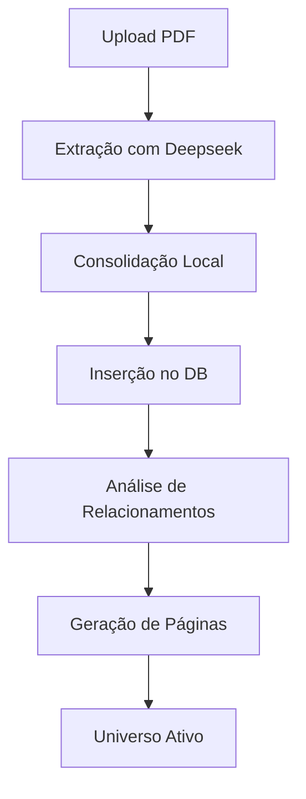
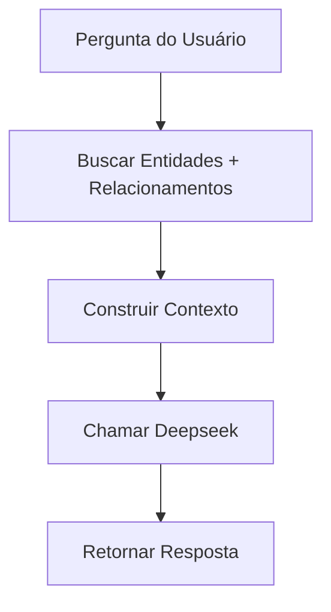

# Estratégia Deepseek - Lumen

## 📊 Status de Implementação

### ✅ Implementado

1. **Extração de Entidades (FASE 1)**
   - Local: `supabase/functions/process-pdf/index.ts`
   - Custo: ~$0.01-0.05 por PDF
   - Status: ✅ Funcionando

2. **Consolidação de Duplicatas (FASE 2)**
   - Local: `supabase/functions/process-pdf/index.ts`
   - Método: Fuzzy matching com Levenshtein distance
   - Status: ✅ Funcionando

3. **Análise de Relacionamentos (FASE 3)**
   - Local: `supabase/functions/process-pdf/index.ts`
   - Custo: ~$0.02-0.10 por universo
   - Status: ✅ Implementado
   - Funcionalidade: Analisa relacionamentos automáticos usando Deepseek

4. **Chat com Universo (FASE 5)**
   - Local: `supabase/functions/universe-chat/index.ts`
   - Custo: ~$0.001-0.01 por pergunta
   - Status: ✅ Melhorado
   - Funcionalidade: Responde perguntas com contexto de relacionamentos

5. **Utilitários Deepseek**
   - Local: `supabase/functions/shared/deepseek-utils.ts`
   - Status: ✅ Implementado
   - Funcionalidades:
     - `callDeepseek()`: Chamada com retry logic
     - `extractJSON()`: Parse de respostas JSON
     - `analyzeRelationships()`: Análise de relacionamentos
     - `analyzeConflicts()`: Análise de conflitos (pronto para usar)
     - `generateSummary()`: Geração de resumos (pronto para usar)
     - `validateQuality()`: Validação de qualidade (pronto para usar)

---

## 🚧 Próximas Implementações

### FASE 4: Análise de Conflitos
**Status:** Preparado (função disponível)  
**Como usar:**
```typescript
import { analyzeConflicts } from '../shared/deepseek-utils.ts';

const conflictAnalysis = await analyzeConflicts(characters, events);
// Retorna: { conflicts: [...], conflictMatrix: {...} }
```

### FASE 6: Modo POV (Point of View)
**Status:** Aguardando implementação  
**Custo:** ~$0.005-0.02 por pergunta  
**Implementação sugerida:**
- Criar nova edge function `character-pov`
- Usar personagem específico como contexto
- Responder em primeira pessoa

### FASE 7: Análise de Temas
**Status:** Aguardando implementação  
**Custo:** ~$0.02-0.10 por universo  
**Implementação sugerida:**
- Adicionar à função `process-pdf`
- Salvar temas em nova tabela `themes`

### FASE 8: Geração de Resumos
**Status:** Preparado (função disponível)  
**Custo:** ~$0.001-0.005 por resumo  
**Como usar:**
```typescript
import { generateSummary } from '../shared/deepseek-utils.ts';

const summary = await generateSummary('CHARACTER', 'Harry Potter', character);
// Retorna: { shortSummary, mediumSummary, longSummary, keyPoints, interestingFact }
```

### FASE 9: Validação de Qualidade
**Status:** Preparado (função disponível)  
**Custo:** ~$0.01-0.05 por universo  
**Como usar:**
```typescript
import { validateQuality } from '../shared/deepseek-utils.ts';

const validation = await validateQuality(characters, locations, events, objects);
// Retorna: { overallQuality, completeness, issues, strengths, recommendations }
```

---

## 💰 Análise de Custo

### Custo por Operação

| Operação | Custo Estimado | Status |
|----------|---------------|--------|
| Extração de entidades | $0.01-0.05 | ✅ |
| Consolidação | Grátis (local) | ✅ |
| Análise de relacionamentos | $0.02-0.10 | ✅ |
| Chat com universo | $0.001-0.01 | ✅ |
| Análise de conflitos | $0.03-0.15 | 🚧 |
| Validação de qualidade | $0.01-0.05 | 🚧 |
| Geração de resumos | $0.001-0.005 | 🚧 |

### ROI com $100/mês

- **PDFs processados:** ~590/mês (custo: ~$0.17/PDF)
- **Perguntas respondidas:** ~10.000-20.000/mês
- **Combinação:** ~300 PDFs + 5.000 perguntas/mês

---

## 🔧 Arquitetura Técnica

### Estrutura de Arquivos

```
supabase/functions/
├── shared/
│   └── deepseek-utils.ts       # Utilitários compartilhados
├── process-pdf/
│   └── index.ts                # Processamento de PDFs
└── universe-chat/
    └── index.ts                # Chat com universos
```

### Fluxo de Processamento



### Fluxo de Chat



---

## 📈 Métricas de Qualidade

### Extração de Entidades
- **Precisão:** ~85-95% (dependendo do PDF)
- **Tempo:** ~5-15 segundos por PDF
- **Token usage:** ~2.000-4.000 tokens

### Consolidação
- **Duplicatas removidas:** ~10-30% das entidades
- **Tempo:** Instantâneo (local)

### Análise de Relacionamentos
- **Relacionamentos identificados:** ~15-30 por universo
- **Tempo:** ~10-20 segundos
- **Token usage:** ~3.000-5.000 tokens

### Chat
- **Tempo de resposta:** ~3-8 segundos
- **Token usage:** ~1.000-2.000 tokens por pergunta
- **Precisão:** ~90% (baseado em contexto fornecido)

---

## 🎯 Melhores Práticas

### 1. Otimização de Prompts
```typescript
// ✅ BOM: Prompt estruturado e específico
const prompt = `Analise os personagens e identifique relacionamentos.

Personagens:
${JSON.stringify(characters, null, 2)}

Retorne JSON com: { "relationships": [...] }`;

// ❌ RUIM: Prompt vago
const prompt = `Me diga sobre os personagens`;
```

### 2. Gerenciamento de Tokens
```typescript
// ✅ BOM: Limitar entidades para evitar overflow
characters.slice(0, 20)  // Primeiros 20 personagens

// ❌ RUIM: Enviar tudo sem limite
characters  // Pode exceder limite de tokens
```

### 3. Tratamento de Erros
```typescript
// ✅ BOM: Retry com exponential backoff
const response = await callDeepseek(prompt, systemPrompt, {
  retries: 3,
  temperature: 0.3
});

// ❌ RUIM: Sem retry
const response = await fetch('...');
```

### 4. Validação de Respostas
```typescript
// ✅ BOM: Validar JSON antes de usar
try {
  const data = extractJSON(response);
  if (!data.relationships) {
    throw new Error('Invalid response format');
  }
} catch (error) {
  console.error('Failed to parse:', error);
}

// ❌ RUIM: Assumir formato correto
const data = JSON.parse(response);
```

---

## 🔍 Debugging

### Ver Logs de Edge Functions
```bash
# No Lovable
1. Ir em Backend → Edge Functions
2. Selecionar função (process-pdf ou universe-chat)
3. Ver logs em tempo real
```

### Testar Localmente
```typescript
// Teste de consolidação
const characters = [
  { name: "Harry Potter", description: "..." },
  { name: "Harry", description: "..." }
];
const consolidated = consolidateCharacters(characters);
console.log(consolidated);  // Deve mesclar duplicatas
```

### Monitorar Custos
```typescript
// Adicionar logging de custos
console.log('Tokens used:', response.usage.total_tokens);
console.log('Estimated cost:', response.usage.total_tokens * 0.00001);
```

---

## 📚 Documentação de Funções

### callDeepseek()
```typescript
/**
 * Chama Deepseek API com retry logic
 * @param prompt - Prompt do usuário
 * @param systemPrompt - Prompt do sistema
 * @param options - Opções (temperature, maxTokens, retries)
 * @returns Resposta em texto
 */
```

### analyzeRelationships()
```typescript
/**
 * Analisa relacionamentos entre entidades
 * @param characters - Lista de personagens
 * @param locations - Lista de locais
 * @param events - Lista de eventos
 * @param universeDescription - Descrição do universo
 * @returns Lista de relacionamentos
 */
```

### extractJSON()
```typescript
/**
 * Extrai JSON de resposta Deepseek
 * Remove markdown e parse JSON
 * @param text - Texto da resposta
 * @returns Objeto JSON
 */
```

---

## 🚀 Roadmap Futuro

### Curto Prazo (1-2 semanas)
- [ ] Implementar análise de conflitos na UI
- [ ] Adicionar validação de qualidade no admin
- [ ] Criar dashboard de estatísticas

### Médio Prazo (1 mês)
- [ ] Implementar modo POV
- [ ] Adicionar análise de temas
- [ ] Criar geração automática de resumos

### Longo Prazo (2-3 meses)
- [ ] Sugestões de universos alternativos (AU)
- [ ] Análise de evolução de personagens
- [ ] Comparação entre universos

---

## 💡 Dicas

1. **Use temperature baixa (0.2-0.4) para tarefas estruturadas**
2. **Use temperature alta (0.6-0.8) para tarefas criativas**
3. **Sempre valide o formato JSON das respostas**
4. **Limite entidades enviadas para evitar overflow de tokens**
5. **Implemente logging detalhado para debug**
6. **Monitore custos regularmente**
7. **Use retry logic para chamadas de API**
8. **Cache resultados quando possível**

---

## 📞 Suporte

Para dúvidas sobre a implementação, consulte:
- Código: `supabase/functions/`
- Logs: Lovable Backend → Edge Functions
- Documentação Deepseek: https://platform.deepseek.com/docs
